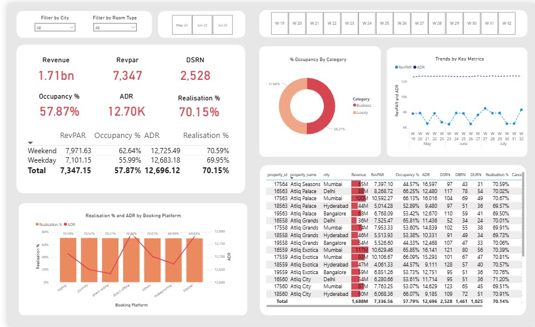

<h1 align="center">📊 Hotel Management Analytics Dashboard</h1>

  <b>Turning raw booking data into revenue-driving decisions</b> 
  Built using Power BI • Data Modeling • DAX

<h2>🏨 Business Problem</h2>

The hospitality industry operates on thin margins and high competition. 
Hotel chains struggle with:

<ul>
  <li>❌ Unclear pricing strategies (ADR not aligned with demand)</li>
  <li>❌ Low occupancy during non-peak periods</li>
  <li>❌ Revenue leakage due to cancellations and inefficiencies</li>
</ul>

Decision-makers often rely on fragmented reports, making it difficult to answer critical questions like:

<ul>
  <li>👉 Which cities are driving the most revenue?</li>
  <li>👉 Are we pricing rooms optimally?</li>
  <li>👉 Which platforms bring high-value customers?</li>
</ul>

<b>This dashboard solves that problem by providing a centralized, interactive analytics system.</b>

<h2>🎯 Solution</h2>

This Power BI dashboard delivers a <b>360° view of hotel performance</b>, enabling stakeholders to:

<ul>
  <li>✔ Monitor key KPIs in real time</li>
  <li>✔ Identify trends and seasonality patterns</li>
  <li>✔ Optimize pricing strategies</li>
</ul>

<h2>📸 Dashboard Preview</h2>

  

<h2>📊 Key Metrics</h2>

<table>
<tr>
<th>Metric</th>
<th>Description</th>
</tr>

<tr>
<td><b>RevPAR</b></td>
<td>Revenue per available room (core performance metric)</td>
</tr>

<tr>
<td><b>ADR</b></td>
<td>Average Daily Rate (pricing effectiveness)</td>
</tr>

<tr>
<td><b>DSRN</b></td>
<td>Daily Sellable Room Nights</td>
</tr>

<tr>
<td><b>Realisation %</b></td>
<td>Actual revenue earned vs potential revenue</td>
</tr>

</table>

<h2>⚙️ Features</h2>

<ul>
  <li>📌 KPI Overview Panel (Revenue, RevPAR, ADR, Occupancy)</li>
  <li>📈 Weekly Trend Analysis</li>
  <li>🏙️ City & Property-Level Insights</li>
  <li>🧩 Customer Category Distribution</li>
  <li>🌐 Booking Platform Performance</li>
  <li>🔍 Interactive Filters (City, Room Type, Date)</li>
</ul>

<h2>🗂️ Data Model</h2>

<b>Star Schema Design</b>

<ul>
  <li><b>Fact Tables:</b>
    <ul>
      <li>fact_bookings.csv</li>
      <li>fact_aggregated_bookings.csv</li>
    </ul>
  </li>
  
  <li><b>Dimension Tables:</b>
    <ul>
      <li>dim_hotels.csv</li>
      <li>dim_rooms.csv</li>
      <li>dim_date.csv</li>
    </ul>
  </li>
</ul>

<h2>🧠 Key Insights</h2>

<ul>
  <li>📍 Revenue concentration across top-performing cities</li>
  <li>📉 Low realization % indicates revenue leakage</li>
  <li>📊 ADR vs Occupancy imbalance highlights pricing inefficiencies</li>
</ul>

<h2>🛠️ Tech Stack</h2>

<ul>
  <li>Power BI (Dashboarding)</li>
  <li>DAX (Measures & Calculations)</li>
  <li>CSV Data Sources</li>
</ul>

<h2>🚀 How to Run</h2>

<ol>
  <li>Download the <code>.pbix</code> file</li>
  <li>Open in <b>Power BI Desktop</b></li>
  <li>Interact with filters and visuals</li>
</ol>

<h2>📈 Future Improvements</h2>

<ul>
  <li>🔮 Demand forecasting using time-series models</li>
  <li>🤖 Customer segmentation using ML</li>
  <li>⚡ Real-time data pipeline integration</li>
</ul>

<h2>👤 Author</h2>

<b>Anjan</b> 

  ⭐ If you find this useful, consider giving it a star!

